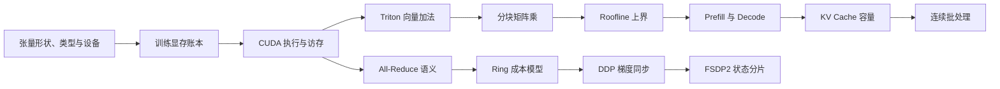

# P0 学习地图

P0 不是框架功能清单，而是理解 AI infra 的共同语言。每个节点都有 `tutorial.md`（导学）与 `lesson.md`（课程正文）；这里仅回答“先学什么、为何相连、在哪台机器验证”。

**路线修正：** 不可从 shape/dtype/device 直接跳到 parameter-memory。必须先建立“模型如何前向、loss 如何反向、参数何时更新、超参如何改变训练”的前置闭环；完成下表后，才进入原表的 parameter-memory（原表第 2 行）和后续系统主线。

`training/memory/activation-memory` 与 CUDA 分支并行学习：它提供 FSDP 所需的状态生命周期和峰值显存语言。

## P0-0：训练闭环前置（必须先完成）

| 顺序 | 叶子材料 | 解决的问题 | 环境 |
|---:|---|---|---|
| 1 | [Transformer 前向导学](/Users/youyu/workspace/python/infra/inference/lifecycle/transformer-forward-shapes/tutorial.md) / [课程](/Users/youyu/workspace/python/infra/inference/lifecycle/transformer-forward-shapes/lesson.md) | token ids 如何经过模型变成 logits；训练和生成如何消费它 | Mac |
| 2 | [训练状态机导学](/Users/youyu/workspace/python/infra/training/single-gpu-loop/training-loop-state-machine/tutorial.md) / [课程](/Users/youyu/workspace/python/infra/training/single-gpu-loop/training-loop-state-machine/lesson.md) | forward、inference、loss、backward、step、zero_grad 的完整顺序 | Mac |
| 3 | [forward/backward 导学](/Users/youyu/workspace/python/infra/training/single-gpu-loop/forward-backward-step/tutorial.md) / [课程](/Users/youyu/workspace/python/infra/training/single-gpu-loop/forward-backward-step/lesson.md) | loss 为什么产生 `.grad`，为什么不直接更新参数 | Mac |
| 4 | [autograd 图导学](/Users/youyu/workspace/python/infra/fundamentals/autograd-graph-and-saved-tensors/grad-fn-chain/tutorial.md) / [课程](/Users/youyu/workspace/python/infra/fundamentals/autograd-graph-and-saved-tensors/grad-fn-chain/lesson.md) | `grad_fn`、leaf、saved tensors 和梯度传播 | Mac |
| 5 | [optimizer 导学](/Users/youyu/workspace/python/infra/training/single-gpu-loop/optimizer-step/tutorial.md) / [课程](/Users/youyu/workspace/python/infra/training/single-gpu-loop/optimizer-step/lesson.md) | SGD/AdamW 如何改变 parameter，state 在哪产生 | Mac |
| 6 | [训练超参导学](/Users/youyu/workspace/python/infra/training/single-gpu-loop/training-hyperparameters/tutorial.md) / [课程](/Users/youyu/workspace/python/infra/training/single-gpu-loop/training-hyperparameters/lesson.md) | batch、T、lr、weight decay、accumulation 的因果关系 | Mac |
| 7 | [学习率调度导学](/Users/youyu/workspace/python/infra/training/single-gpu-loop/learning-rate-scheduler/tutorial.md) / [课程](/Users/youyu/workspace/python/infra/training/single-gpu-loop/learning-rate-scheduler/lesson.md) | warmup/decay 与 update step、恢复训练的关系 | Mac |

完成 P0-0 后，回到下表的 `parameter-memory`；`shape-dtype-device` 仍是所有课程的共同前置，需要时回看其课程正文。

| 顺序 | 叶子教程 | 本次要学会的机制 | 验证环境 | 完成后进入 |
|---:|---|---|---|---|
| 1 | [导学](/Users/youyu/workspace/python/infra/fundamentals/pytorch-tensor-lifecycle/shape-dtype-device/tutorial.md) / [课程](/Users/youyu/workspace/python/infra/fundamentals/pytorch-tensor-lifecycle/shape-dtype-device/lesson.md) | shape、dtype、device 与 payload 字节 | Mac | 参数显存 |
| 2 | [导学](/Users/youyu/workspace/python/infra/training/memory/parameter-memory/tutorial.md) / [课程](/Users/youyu/workspace/python/infra/training/memory/parameter-memory/lesson.md) | 参数、梯度、优化器状态的分账 | Mac | 激活显存 |
| 3 | [导学](/Users/youyu/workspace/python/infra/training/memory/activation-memory/tutorial.md) / [课程](/Users/youyu/workspace/python/infra/training/memory/activation-memory/lesson.md) | saved tensors 与 backward 生命周期 | Mac / WSL2-GPU | CUDA 执行模型 |
| 4 | [导学](/Users/youyu/workspace/python/infra/operators/cuda/execution-model/thread-block-grid/tutorial.md) / [课程](/Users/youyu/workspace/python/infra/operators/cuda/execution-model/thread-block-grid/lesson.md) | 元素到 thread/block/grid 的映射 | WSL2-GPU | 合并访存 |
| 5 | [导学](/Users/youyu/workspace/python/infra/operators/cuda/memory-hierarchy/global-memory-coalescing/tutorial.md) / [课程](/Users/youyu/workspace/python/infra/operators/cuda/memory-hierarchy/global-memory-coalescing/lesson.md) | warp 地址模式与有效带宽 | WSL2-GPU | Triton 向量加法 |
| 6 | [导学](/Users/youyu/workspace/python/infra/operators/triton/vector-add/tutorial.md) / [课程](/Users/youyu/workspace/python/infra/operators/triton/vector-add/lesson.md) | SPMD program、pointer block、mask | WSL2-GPU | 分块矩阵乘 |
| 7 | [导学](/Users/youyu/workspace/python/infra/operators/triton/matmul/tiled-matmul/tutorial.md) / [课程](/Users/youyu/workspace/python/infra/operators/triton/matmul/tiled-matmul/lesson.md) | tile、K 循环与数据复用 | WSL2-GPU | Roofline |
| 8 | [导学](/Users/youyu/workspace/python/infra/operators/profiling/roofline-model/tutorial.md) / [课程](/Users/youyu/workspace/python/infra/operators/profiling/roofline-model/lesson.md) | FLOPs/bytes 与硬件上界 | WSL2-GPU | Prefill/Decode |
| 9 | [导学](/Users/youyu/workspace/python/infra/inference/lifecycle/prefill-vs-decode/tutorial.md) / [课程](/Users/youyu/workspace/python/infra/inference/lifecycle/prefill-vs-decode/lesson.md) | 两阶段 shape 与延迟指标 | Mac / WSL2-GPU | KV Cache 容量 |
| 10 | [导学](/Users/youyu/workspace/python/infra/inference/kv-cache/kv-shape-and-capacity/tutorial.md) / [课程](/Users/youyu/workspace/python/infra/inference/kv-cache/kv-shape-and-capacity/lesson.md) | 每 token K/V 字节与并发上限 | Mac / WSL2-GPU | 连续批处理 |
| 11 | [导学](/Users/youyu/workspace/python/infra/inference/scheduling/continuous-batching/tutorial.md) / [课程](/Users/youyu/workspace/python/infra/inference/scheduling/continuous-batching/lesson.md) | iteration 级调度和请求状态机 | Mac | All-Reduce |
| 12 | [导学](/Users/youyu/workspace/python/infra/communication/collectives/all-reduce/tutorial.md) / [课程](/Users/youyu/workspace/python/infra/communication/collectives/all-reduce/lesson.md) | collective 语义与 rank 合约 | Mac / WSL2-GPU | Ring All-Reduce |
| 13 | [导学](/Users/youyu/workspace/python/infra/communication/algorithms/ring-allreduce/tutorial.md) / [课程](/Users/youyu/workspace/python/infra/communication/algorithms/ring-allreduce/lesson.md) | reduce-scatter、all-gather、alpha-beta | Mac | DDP |
| 14 | [导学](/Users/youyu/workspace/python/infra/distributed-training/data-parallel/ddp-gradient-allreduce/tutorial.md) / [课程](/Users/youyu/workspace/python/infra/distributed-training/data-parallel/ddp-gradient-allreduce/lesson.md) | autograd hook、bucket、通信重叠 | WSL2-GPU | FSDP2 |
| 15 | [导学](/Users/youyu/workspace/python/infra/distributed-training/sharded-data-parallel/fsdp2/fully-shard-api/tutorial.md) / [课程](/Users/youyu/workspace/python/infra/distributed-training/sharded-data-parallel/fsdp2/fully-shard-api/lesson.md) | all-gather、reduce-scatter、状态所有权 | WSL2-GPU | P1 并行策略 |

## 使用规则

1. 从表中当前节点的 `tutorial.md` 开始，再完整阅读同一行的 `lesson.md`；不先跳进框架源码或官方长文档。
2. 在课程正文的“实验课”先写预测，再打开 `lab.*` 或自己创建最小实验。
3. 实验结果和纠错写入该叶子的 `note.md`，不要改写教程正文。
4. 完成闭卷问题后才进入下一行；若 GPU 实验暂时不可跑，完成 Mac toy 并标明“性能结论待 WSL2-GPU 验证”。
